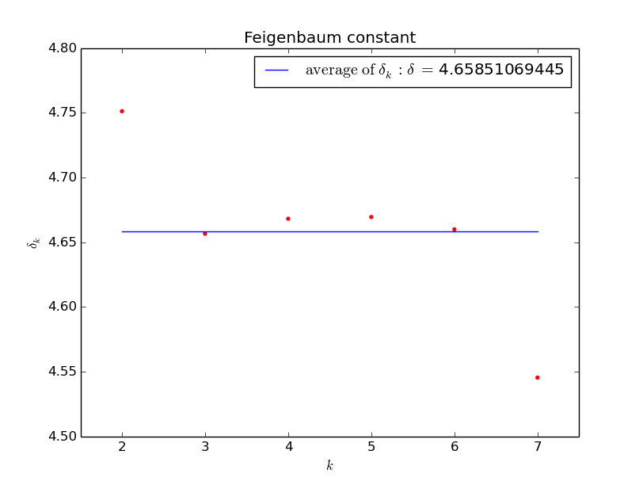

.. _6-6-label:

=========================================================================
問題6.6 - ファイゲンバウム定数の評価
=========================================================================

.. contents::

シミュレーションの目的
============================

すでに\ :ref:`問題6.2 <6-2-label>`\ で見たように、隣り合う分岐の間の\ :math:`r`\ の領域は周期の増大にしたがって小さくなる(\ :ref:`表1 <tab-6-6-t1>`\ )。例えば、\ :math:`b_{2}-b_{1}=0.2398`\ 、\ :math:`b_{3}-b_{2}=0.023624`\ 、\ :math:`b_{4}-b_{3}=0.00508`\ となっているので、\ :math:`b_{k}-b_{k-1}`\ が等比的、つまり一定の比\ :math:`(b_{k}-b_{k-1})/(b_{k+1}-b_{k})`\ で減少すると推定してよいであろう。この比は正確に一定にはならないが、\ :math:`k`\ が大きくなるとともに一定値に近づくことを確かめることができる。これは\ :math:`b_{k}`\ の数列には極限があり、

.. math:: b_{k} \approx r_{\infty} -c \delta ^{-k}
    :label: e1

のように等比的に漸近すると考えられる(cは定数)。ここで\ :math:`\delta`\ はファイゲンバウム(Feigenbaum)定数と呼ばれている。式\ :eq:`e1`\ から\ :math:`\delta`\ は比

.. math:: \delta = \lim_{k \rightarrow \infty} \displaystyle\frac{b_{k}-b_{k-1}}{b_{k+1}-b_{k}}

で与えられる。

.. _tab-6-6-t1:

.. csv-table::\ :math:`k`\ 番目の分岐が生じる点における制御パラメータ\ :math:`b_{k}`\ の値
    :header:\ :math:`k`\ , :math:`b_{k}`
    :widths: 2, 10
    
    1 , 0.750\ 000
    2 , 0.862\ 372
    3 , 0.886\ 023
    4 , 0.891\ 102
    5 , 0.892\ 100
    6 , 0.892\ 423
    7 , 0.892\ 473
    8 , 0.892\ 484

作成したプログラム
=============================

Pythonを用いて作成したプログラムを以下に示す。

* :download:`6-6_feigenbaum-a.py <6-6_feigenbaum-a.py>` 

このプログラムでは\ :ref:`表1 <tab-6-6-t1>`\ の数値\ :math:`b_{k}`\ を使って\ :math:`\delta_{k}=(b_{k}-b_{k-1})/(b_{k+1}-b_{k})`\ を\ :math:`k`\ に対してプロットし、単純な相加平均によって\ :math:`\delta`\ を求めることができる。

.. literalinclude:: 6-6_feigenbaum-a.py
    :language: python
    :linenos:

* :download:`6-6_feigenbaum-fit.py <6-6_feigenbaum-fit.py>` 

下のプログラムを実行すると、プログラム内で指定されたパラメータ初期値を用いて、最小2乗法により式\ :eq:`e1`\ におけるパラメータ\ :math:`c`\ 、\ :math:`r_{\infty}`\ を求めることができる。モジュールとしてscipyモジュールのoptimizeを用いている。

.. literalinclude:: 6-6_feigenbaum-fit.py
    :language: python
    :linenos:

実習課題
=====================

a. 作成したプログラムを使って、\ :math:`\delta_{k}=(b_{k}-b_{k-1})/(b_{k+1}-b_{k})`\ を\ :math:`k`\ に対してプロットし、\ :math:`\delta`\ を求めよ。\ :math:`b_{k}`\ の\ :ref:`表1 <tab-6-6-t1>`\ に与えられた値の桁数はどの\ :math:`k`\ についても十分か。最も精度よく求められている\ :math:`\delta`\ の値は
 
.. math:: \delta = 4.669\ 201\ 609\ 102\ 991 \cdots
    :label: e2

である。式\ :eq:`e2`\ の小数点以下の桁は、\ :math:`\delta`\ が高い精度で求められていることを示している。式\ :eq:`e1`\ 、式\ :eq:`e2`\ および\ :math:`b_{k}`\ の値を使って\ :math:`r_{\infty}`\ の値を求めよ。
    
まず、\ :math:`\delta_{k}=(b_{k}-b_{k-1})/(b_{k+1}-b_{k})`\ を\ :math:`k`\ に対してプロットしたグラフを、\ :num:`図#fig-6-6-f1`\ に示した。ここで単純に全体の相加平均を求め、その結果を直線にしてグラフに描いた。また、表に与えられた\ :math:`b_{k}`\ の桁数について、\ :math:`b_{k}`\ の間隔が\ :math:`k`\ が大きくなるにつれて減少していくことを考えると、\ :math:`b_{8}`\ の桁数などは十分であるとは言えないだろう。実際、平均値として得られた\ :math:`\delta`\ が、精度よく求められている\ :math:`\delta`\ の値に近いのに対して、本来\ :math:`k`\ が大きいところでは収束するはずの\ :math:`\delta_{k}`\ が、そこからずれた値となっていることも、\ :math:`b_{8}`\ などの桁数が不足していることを表していると言える。

次に、最小2乗法により式\ :eq:`e1`\ におけるパラメータ\ :math:`c`\ 、\ :math:`r_{\infty}`\ を求め、その結果を表に示す。ここで、得られた値\ :math:`r_{\infty}=0.892 546 164 091`\ は非常に正確に調べられていて、その値は\ :math:`r_{\infty}=0.892 486 417 967 \cdots`\ である。すなわち、得られた\ :math:`r_{\infty}`\ はよく知られている値に対してわずか約0.007％の誤差で精度よく求めることができていることがわかる。

.. _fig-6-6-f1:

    
    \ :math:`\delta_{k}`\ を\ :math:`k`\ に対してプロットしたグラフ

.. csv-table:: 最小2乗法によって式\ :eq:`e1`\ にフィッティングした時のパラメータの値
    :header: パラメータ, 値
    :widths: 2 , 2

    :math:`c`\ , 0.665237682254
    :math:`r_{\infty}`\ , 0.892546164091

まとめ
=======================

ファイゲンバウム定数の算出を行い、その普遍的性質への理解を深めることができた。

参考文献
============================

* ハーベイ・ゴールド,ジャン・トボチニク,石川正勝・宮島佐介訳『計算物理学入門』,ピアソン・エデュケーション, 2000.

